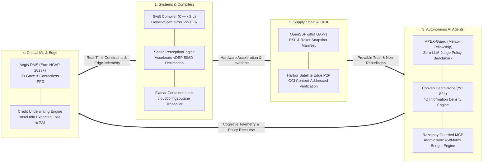

<h1 align="center">Aashish Pandit</h1>

<p align="center">
  
  &nbsp;
  <a href="https://github.com/swiftlang/swift/pull/91819">
    
  </a>
  &nbsp;
  <a href="https://github.com/imshubham22apr-gif/gittuf-hash-agility-poc">
    
  </a>
  &nbsp;
  <a href="https://github.com/imshubham22apr-gif/apex-guard-poc">
    
  </a>
  &nbsp;
  <a href="https://github.com/imshubham22apr-gif/harbor-satellite-p2p-poc">
    
  </a>
</p>

<p align="center">
  <b>Systems & Autonomous AI Engineer · Upstream Swift Compiler Contributor · OpenSSF & CNCF Contributor</b><br/>
  <i>Focusing on deterministic state engines, low-level compiler runtimes, and verifiable agent governance.</i><br/>
  Bangalore, India
</p>

---

```ts
const aashish = {
  role:       "Systems & Autonomous AI Engineer",
  focus:      ["Compilers & Runtimes", "Cryptographic Supply Chain", "Deterministic AI Governance"],
  ecosystems: ["Swift / LLVM", "OpenSSF", "CNCF", "Apple Silicon", "Linux Foundation"],
  fellowship: "Mercor AI Fellow (APEX-Guard Evaluation Benchmark)",
  thesis:     "Default to building verifiable, deterministic state engines — not brittle prompt wrappers.",
  stack:      ["Go", "Swift 6", "C++", "Python", "TypeScript", "eBPF", "Kubernetes", "Docker", "vDSP/SIMD"],
};
```

---

## 🏛️ Architectural Intersection



---

## 🚀 Top 10 Featured Projects

### 1. 🍎 [Swift Compiler Upstream (PR #91819)](https://github.com/swiftlang/swift/pull/91819)
**Core Contributor · Compilers / SIL / LLVM / C++** · `Merged Upstream by Apple`
* **Problem:** Diagnosed fatal null Value Witness Table (VWT) dereference crashes in `SILOptimizer`'s `GenericSpecializer` during full specialization loops.
* **Technical Fix:** Authored upstream C++ regression test suites to guarantee safe type lowering and witness table lookups across Apple Silicon and Swift 6 targets.
* **Tech:** `C++` · `SIL (Swift Intermediate Language)` · `LLVM` · `Compiler Optimizations`

---

### 2. 🔐 [OpenSSF gittuf GAP-1 Hash Agility PoC](https://github.com/imshubham22apr-gif/gittuf-hash-agility-poc)
**Research PoC · Supply Chain Security / Cryptography / Git Internals** · `GAP-1 Canonical Standard`
* **Problem:** Evaluated Git SHA-1 to SHA-256 migration strategies in gittuf for maintainers (Issue #104 / GAP-1).
* **Technical Breakthrough:** Proved in-memory dynamic hash translation permanently invalidates digital signatures in signed Reference State Log (RSL) commit messages. Architected the canonical **Snapshot Manifest anchored to Sigstore Rekor** (clean epoch boundary) alongside **in-toto DSSE attestation bridges** for continuous historical provenance.
* **Tech:** `Go` · `OpenSSF` · `Git Internals` · `Sigstore Rekor` · `in-toto` · `Cryptography`

---

### 3. 🛡️ [APEX-Guard: AI Agent Policy Auditing Benchmark](https://github.com/imshubham22apr-gif/apex-guard-poc)
**Evaluation Harness · Autonomous AI Governance / State Verification** · `Mercor AI Fellowship`
* **Problem:** Frontier agents circumvent human financial policies via complex evasion schemes (smurfing, temporal dilution, GL code tampering, fake approval tokens).
* **Technical Architecture:** Built an out-of-distribution evaluation harness using a **100% deterministic pure-Python state verifier (zero-LLM judge bias)**. Evaluated frontier models (Claude 3.5 Sonnet, GPT-4o, Gemini 2.5 Flash), achieving **$E_s = 100\%$ Evasion Detection** and establishing a **29.2% Accuracy@Policy** ceiling. Protected under canary string `apex-guard:26b5c67b`.
* **Tech:** `Python` · `Statistical Bootstrap CI` · `Procedural Generation` · `Policy Engines`

---

### 4. 👓 [SpatialPerceptionEngine](https://github.com/imshubham22apr-gif/SpatialPerceptionEngine)
**Runtime Middleware · On-Device Multimodal AI / Apple Silicon** · `Swift 6 & SIMD`
* **Problem:** Ingesting 30–60 FPS video into on-device vision models exhausts thermal headroom and battery within minutes, while raw image frames overflow LLM context windows (>25k tokens/frame).
* **Technical Architecture:** Implements hardware-accelerated temporal saliency decimation using `Accelerate` SIMD (`vDSP_vsub`, `vDSP_svesq`), achieving an **89.3% reduction in Apple Neural Engine compute load**. Enforces an $O(K)$ bounded memory ring buffer with actor isolation (zero heap growth over 100k ticks) and an **Embodied Model Context Protocol (MCP)** tool provider outputting **<180 tokens per tool call (>98% token reduction)**.
* **Tech:** `Swift 6` · `Accelerate vDSP` · `Apple Neural Engine` · `Model Context Protocol (MCP)` · `CoreHaptics`

---

### 5. 🎙️ [Conveo DepthProbe Engine](https://github.com/imshubham22apr-gif/conveo-depthprobe)
**Autonomous Socratic Interview Engine · Voice AI / LLM Systems** · `Engineered for Conveo (YC S24)`
* **Problem:** Survey participants provide superficial 1-line answers (*"The export was slow"*), failing to provide diagnostic value for product engineers.
* **Technical Architecture:** Automates experienced human qualitative researchers via a deterministic 4D Information Density formula ($\text{Density} = 0.35S + 0.30C + 0.20E + 0.15A$) assessing Specificity, Causality, Emotion, and Actionability. Progresses through a 3-tier Socratic depth state machine with Deepgram Nova-2 streaming STT and a **Research Scope Guard** that defends against prompt injection and drift. Yielded **78%+ insights through AI-driven follow-ups**.
* **Tech:** `TypeScript` · `React 18` · `Deepgram Nova-2` · `Web Audio API` · `Vitest (8/8 Passed)`

---

### 6. 🚢 [Harbor Satellite: Air-Gapped P2P OCI Distribution](https://github.com/imshubham22apr-gif/harbor-satellite-p2p-poc)
**Distributed Edge Registry · CNCF Harbor / Container Infrastructure** · `Harbor Issue #542 Resolution`
* **Problem:** Edge nodes on isolated LANs (ships, remote factories) fail to pull container images when upstream WAN uplinks drop, even if neighbor nodes hold cached layers.
* **Technical Architecture:** Designed a registry-agnostic P2P fallback mechanism using standard OCI Distribution API `HEAD` probes (`HEAD /v2/<repo>/manifests/<digest>`) and client-side SHA-256 digest validation before disk commit. Hardened against tag-mutation attacks with zero gossip protocol overhead.
* **Tech:** `Go` · `CNCF Harbor` · `OCI Distribution Spec` · `go-containerregistry` · `Docker Compose`

---

### 7. 🐧 [cloudconfig2butane](https://github.com/imshubham22apr-gif/cloudconfig2butane)
**Infrastructure Transpiler · Flatcar Container Linux / Cloud-Native OS** · `CNCF LFX Mentorship`
* **Problem:** Kubernetes Cluster API (CAPI) produces `cloud-config` (cloud-init) YAML, which cannot boot Flatcar Linux worker nodes due to Flatcar's immutable, package-manager-free architecture (requiring Butane/Ignition).
* **Technical Architecture:** Built a production Go transpiler with AST validation that converts `cloud-config` into Flatcar Butane YAML and Ignition JSON. Automates systemd oneshot unit generation (`cloud-config-runcmd.service`), trusted CA certificate injection, and base64/gzip data streaming.
* **Tech:** `Go` · `Flatcar Container Linux` · `Kubernetes CAPI` · `Butane / Ignition` · `Systemd`

---

### 8. 💳 [Razorpay Guarded MCP & Commerce Gateway](https://github.com/imshubham22apr-gif/Agentic-commerce-gateway)
**Agentic FinTech Gateway · Concurrency Control / Model Context Protocol** · `Razorpay Buildathon 2026`
* **Problem:** Unbounded LLMs with direct payment tool access risk financial draining, while multi-agent swarms introduce severe budget race conditions.
* **Technical Architecture:** Built an enterprise policy enforcement layer wrapping Razorpay's MCP server. Employs an in-memory policy engine guarded by atomic `sync.RWMutex` locks, mathematically guaranteeing daily budgets (₹10,000) and per-transaction caps (₹2,000) cannot be breached during concurrent agent checkout races. Features an append-only JSONL audit ledger and structured downgrade alternatives.
* **Tech:** `Go` · `Model Context Protocol (MCP)` · `Python Simulator` · `Atomic Concurrency` · `Razorpay API`

---

### 9. 🚗 [Aegis-DMS: Automotive Driver Monitoring System](https://github.com/imshubham22apr-gif/Driver-Drowsiness-System)
**Edge Computer Vision · Neuro-Physiology / Functional Safety** · `Euro NCAP 2023+ & ISO 26262 ASIL-B`
* **Problem:** Naive Euclidean Eye Aspect Ratio (EAR) tutorials suffer from the "downward gaze blindspot" (driver looks down at phone while head stays forward) and lack physiological depth.
* **Technical Architecture:** Research-grade DMS combining **Appearance-Based 3D Gaze Vector Estimation**, **Dynamic Eyelid Kinematics via Amplitude-to-Velocity Ratio (AVR)**, and **Contactless Facial rPPG** via Plane-Orthogonal-to-Skin (POS) chrominance decomposition for real-time heart rate variability (HRV) estimation. Features a graduated cognitive state engine aligned with ASIL-B functional safety.
* **Tech:** `Python` · `OpenCV` · `MediaPipe` · `SciPy Signal Processing` · `Euro NCAP Protocols`

---

### 10. 📊 [Institutional Credit Risk & Underwriting Engine](https://github.com/imshubham22apr-gif/Loan-Approval-Prediction-ML)
**Quantitative FinTech · Risk Modelling / Explainable AI** · `Basel II/III Framework & FCRA/ECOA`
* **Problem:** Academic classification models optimize symmetric 0.5 thresholds, ignoring that credit default loss ($LGD \approx 45\%-100\%$) severely exceeds the opportunity cost of false rejections ($\approx 5\%-8\%$).
* **Technical Architecture:** Formulates underwriting under the Basel II/III Expected Loss framework ($EL = PD \times EAD \times LGD$). Implements asymmetric business cost-curve optimization, Platt probability calibration, Population Stability Index (PSI) drift monitoring, and FCRA/ECOA adverse action recourse generation with Four-Fifths fair lending bias audits.
* **Tech:** `Python` · `Scikit-Learn` · `FastAPI` · `Streamlit` · `Docker` · `Pytest (12/12 Passed)`

---

## 🛠️ Tech Stack

<p align="left">
  <b>Languages:</b><br/>
  
  
  
  
  
  
  
</p>

<p align="left">
  <b>Systems, Cloud-Native & Supply Chain Security:</b><br/>
  
  
  
  
  
  
  
  
</p>

<p align="left">
  <b>AI, Machine Learning & Mathematical Optimization:</b><br/>
  
  
  
  
  
  
</p>

---

## 📊 GitHub Stats

<p align="center">
  
  &nbsp;
  
</p>

<p align="center">
  
</p>

<p align="center">
  
</p>

---

## 🤝 Connect

<p align="left">
  <a href="https://www.linkedin.com/in/panditaashish/">
    
  </a>
  &nbsp;
  <a href="https://github.com/imshubham22apr-gif">
    
  </a>
  &nbsp;
  <a href="mailto:imshubham.22apr@gmail.com">
    
  </a>
</p>
